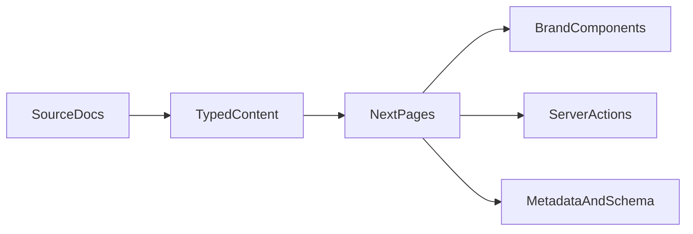

# Elements Workspace

Marketing site project for `Elements Workspace`, a homeschooling enrichment center in Brooklyn.

This repository currently contains the planning and source content for the site rebuild. The site itself is intended to be rebuilt as a lean, high-performance `Next.js 15` App Router project.

## Project In One Minute

### Business Context

Elements Workspace is a Montessori-inspired enrichment center for homeschooling families in Brooklyn. The website needs to communicate:

- intimate scale
- serious learning
- close-knit community
- trust in the guides and environment

### Site Shape

This is primarily a content-driven marketing site, not a complex product or SaaS app.

Core pages:

- Homepage
- About
- Programs
- Summer Camp
- Our Team
- FAQ
- Contact

Primary conversion actions:

- Book a Tour
- Join the Fall 2026 Waitlist
- Contact Jenny

## Current Repository State

Right now the repo is in planning mode. The key source documents live at the root:

- [`elements-brand-design-system.md`](./elements-brand-design-system.md)
- [`elements-website-content-v3.md`](./elements-website-content-v3.md)
- [`elements-photo-placement-guide.html`](./elements-photo-placement-guide.html)

The detailed execution roadmap lives here:

- [`docs/260322COMMS_ELEMENTS_WORKSPACE__SITE_BUILD_ROADMAP.md`](./docs/260322COMMS_ELEMENTS_WORKSPACE__SITE_BUILD_ROADMAP.md)

If you are new to the project, read those four files in that order.

## Recommended Stack

The agreed direction is:

- `Next.js 15`
- App Router
- `TypeScript`
- `Tailwind CSS`
- `next/font` for `Lora` and `DM Sans`
- `next/image`
- `Server Actions`
- `zod`
- `Vercel`

## Important Technical Opinion

Do not build this like a generic component-library site.

Plain English:

- The content and brand are already carefully defined.
- The design should feel editorial, warm, and custom.
- Use the framework for structure and performance, not for generic look-and-feel.

That means:

- custom brand components first
- minimal JavaScript
- minimal dependencies
- `shadcn` only as an occasional primitive source, not the visual foundation

## Architecture Direction

### Core Principle

Keep content separate from presentation.

Simple version:

- page components render sections
- content modules store the copy and page data
- shared components handle layout and brand consistency

### Target Shape

```text
app/
  page.tsx
  about/page.tsx
  programs/page.tsx
  summer-camp/page.tsx
  team/page.tsx
  faq/page.tsx
  contact/page.tsx
components/
  marketing/
  forms/
  ui/
content/
  shared/
  pages/
lib/
  actions/
  schemas/
public/
  images/
docs/
README.md
```

### High-Level Flow



## Source Of Truth

### Brand

Use [`elements-brand-design-system.md`](./elements-brand-design-system.md) for:

- colors
- typography
- voice
- spacing
- component styling
- photo rules

### Copy

Use [`elements-website-content-v3.md`](./elements-website-content-v3.md) for:

- page copy
- nav structure
- CTA destinations
- SEO titles and descriptions
- forms and lead requirements

### Photo Direction

Use [`elements-photo-placement-guide.html`](./elements-photo-placement-guide.html) for:

- required photo slots
- aspect ratios
- subject guidance
- hold-only photos

## Content Rules

Store launch content in typed code modules, not scattered inline in page files.

Why:

- easier to edit
- easier to review
- safer for hold-only content
- easier to move into a CMS later

## Hold Content

Some content must not ship until approved.

Examples:

- Summer Camp tuition
- Moonstones lead guide details
- Starbirds lead guide details

Do not hide these with CSS or leave them half-wired in page markup. Represent them explicitly in the content layer so the UI never renders them until approved.

## Design And UX Guardrails

- Server components by default
- Client components only where interaction actually requires them
- Use `next/image` for real image assets
- Keep mobile layouts first-class, not a final cleanup step
- Avoid heavy third-party embeds unless they clearly help conversion
- Avoid heavy animation
- Avoid component-library-driven styling

## Forms Guidance

Forms in scope:

- waitlist form
- contact form

Recommended implementation:

- accessible inputs
- `zod` validation
- `Server Actions`
- one clear lead destination per form

Start simple. A form that reliably reaches Jenny is more important than a fancier integration stack.

## SEO And Performance Priorities

This site will live or die on fundamentals, not hacks.

Priorities:

- fast load times
- strong metadata
- local SEO around Brooklyn and Gerritsen Beach
- accessible semantic structure
- clean mobile typography
- good image loading behavior

## Working Sequence

If you are picking the project back up, follow this order:

1. Read the source docs.
2. Read the roadmap in `docs/`.
3. Build the project foundation and brand tokens first.
4. Create the typed content layer before building full pages.
5. Build the shared shell.
6. Build the homepage.
7. Build the inner pages.
8. Add forms.
9. Finish SEO, accessibility, and launch prep.

## Expected Commit Rhythm

Use checkpoint commits between major phases.

Suggested cadence:

1. Foundation
2. Brand tokens and shared primitives
3. Content model and route skeleton
4. Shared shell and homepage
5. Programs and Summer Camp
6. About, Team, FAQ, Contact
7. Forms
8. SEO, accessibility, performance
9. Launch prep

See the roadmap doc for fuller commit suggestions.

## Suggested Dependencies

Keep the dependency list short.

Likely enough for v1:

- `next`
- `react`
- `react-dom`
- `typescript`
- `tailwindcss`
- `zod`
- maybe `@radix-ui/react-accordion`

Be skeptical of every additional dependency. Most marketing sites get slower and messier because small conveniences accumulate into permanent complexity.

## Development Notes For The Next Developer

- This project is brand-sensitive. Small styling decisions matter.
- The main risk is building something technically correct but visually generic.
- The second main risk is overengineering forms and CMS concerns before they are actually needed.
- Treat copy and image handling as product work, not content afterthoughts.
- If a choice trades a little developer convenience for a noticeably better brand result, that is often the right trade here.

## Open Decisions To Keep In Mind

These do not block the current direction, but they may need confirmation during implementation:

- final lead destination for forms
- final Summer Camp registration link
- final approved team/guide content
- whether the contact page should include a live map embed or just a map link/card
- whether a CMS is truly needed after launch

## Definition Of Success

The project is in a good state when:

- the site feels custom and trustworthy
- the homepage clearly communicates the business quickly
- forms work reliably
- the site is fast on mobile
- hold-only content is protected
- future developers can update content without untangling page markup
