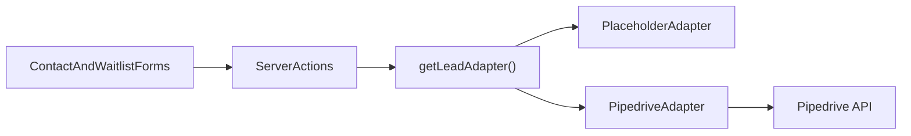

## Elements Workspace Pipedrive Integration Later Plan

## What This Document Is

This document explains how to integrate Pipedrive later without blocking the current site launch work.

Plain English:

- The website should keep moving even if the CRM is not finalized yet.
- We already created a provider boundary so forms do not depend directly on one CRM.
- When it is time to connect Pipedrive, the work should happen inside the adapter layer instead of spreading across page code and form components.

Current relevant files:

- `lib/crm/types.ts`
- `lib/crm/get-lead-adapter.ts`
- `lib/crm/adapters/placeholder.ts`
- `lib/crm/adapters/pipedrive.ts`
- `lib/actions/submit-contact.ts`
- `lib/actions/submit-waitlist.ts`
- `.env.example`

## Why We Deferred It

### Why This Is Deferred In Plain English

We postponed the live Pipedrive work because the risky part is not the API call itself. The risky part is guessing the wrong business workflow.

If we wire the CRM too early, we may end up:

- mapping fields incorrectly
- creating the wrong record types
- duplicating people or leads
- forcing future cleanup in Pipedrive

### Technical Summary

The forms already submit through server actions, validate with `zod`, and route through a provider adapter. That means the CRM work is now isolated to a narrow implementation seam.



## Current State

- `LEAD_PROVIDER=placeholder` is the default safe mode
- `pipedrive` exists as a named provider option
- the Pipedrive adapter intentionally fails loudly if selected before setup is finished
- form components do not need to change when the CRM goes live

## What Must Be Confirmed Before Wiring Pipedrive

These are the decisions that matter most. Do not skip them.

### Business Questions

- Should form submissions create `lead` records, `person` records, or both?
- Should waitlist submissions and contact submissions go to the same Pipedrive pipeline?
- Should general contact messages create a lead at all, or just a person plus note/activity?
- What lead status should be applied to:
  - contact inquiries
  - Fall waitlist submissions
- Should repeated submissions from the same email update an existing person or create a new lead each time?

### Data Mapping Questions

- Which Pipedrive fields are standard vs custom fields?
- What are the exact IDs for custom fields in the target account?
- Is `child age` stored as text, note content, or a custom field?
- Is `program interest` stored as a tag, custom field, note, or lead title input?
- Is `how did you hear about us` worth a dedicated custom field?

### Operational Questions

- Who monitors failures?
- Do we need retry behavior?
- Is it acceptable to silently fall back to email/manual entry if the CRM is down, or should the form fail visibly?
- Do we need an audit log on our side?

## Recommended Integration Shape

### Integration Shape In Plain English

Keep the integration boring.

The server action should:

1. validate the payload
2. normalize it
3. pass it to one adapter

The adapter should:

1. map fields into Pipedrive format
2. call the Pipedrive API
3. throw clear errors on failure

### Technical Direction

- keep all provider-specific logic inside `lib/crm/adapters/pipedrive.ts`
- optionally add small mapping helpers in `lib/crm/` if the file grows
- do not let server actions know about Pipedrive field IDs
- do not let React form components know about CRM concepts

Recommended future structure:

```text
lib/
  crm/
    adapters/
      pipedrive.ts
      placeholder.ts
    mappings/
      pipedrive-contact.ts
      pipedrive-waitlist.ts
    get-lead-adapter.ts
    types.ts
```

## Suggested Pipedrive Model

This is a recommendation, not a guaranteed final answer.

### Contact Form Strategy

Recommended default:

- upsert `person` by email
- create a note attached to that person
- optionally create a lead only if the message indicates real enrollment intent

Reason:

- not every contact message is sales-pipeline-worthy
- creating leads for every message can pollute the pipeline

### Waitlist Form Strategy

Recommended default:

- upsert `person` by email
- create a `lead`
- add the waitlist-specific fields
- attach a note with the freeform message if present

Reason:

- waitlist submissions are closer to a true enrollment pipeline event

## Field Mapping Recommendation

### Contact Form Field Mapping

- `name` -> person name
- `email` -> person email
- `childAges` -> custom field or note
- `programInterest` -> custom field
- `message` -> note body

### Waitlist Form Field Mapping

- `parentName` -> person name
- `email` -> person email
- `childName` -> custom field or note
- `childAge` -> custom field
- `programInterest` -> custom field
- `referralSource` -> custom field
- `note` -> note body

## Environment Variables

Current placeholders:

- `LEAD_PROVIDER`
- `PIPEDRIVE_API_TOKEN`
- `PIPEDRIVE_BASE_URL`

Likely future additions:

- `PIPEDRIVE_PIPELINE_ID`
- `PIPEDRIVE_STAGE_ID_WAITLIST`
- `PIPEDRIVE_STAGE_ID_CONTACT`
- `PIPEDRIVE_FIELD_ID_CHILD_AGE`
- `PIPEDRIVE_FIELD_ID_CHILD_NAME`
- `PIPEDRIVE_FIELD_ID_PROGRAM_INTEREST`
- `PIPEDRIVE_FIELD_ID_REFERRAL_SOURCE`

Simple version:

if a field uses a Pipedrive custom field, store the ID in env or a dedicated config file and keep it out of page code.

## Phase Plan

## Phase 1: Confirm The CRM Workflow

### Phase 1 Goal

Lock the actual business behavior before writing API code.

### Phase 1 Plain-English Summary

This phase is mostly decision-making. It prevents us from implementing a clean but wrong integration.

### Phase 1 Technical Breakdown

- confirm which records should be created
- confirm lead vs person behavior
- confirm custom fields
- confirm dedupe behavior

### Phase 1 Checkpoint Commit

`docs: define pipedrive integration contract`

### Phase 1 Checklist

- [ ] Confirm whether contact form creates a lead, person, or both
- [ ] Confirm whether waitlist form creates a lead, person, or both
- [ ] Confirm dedupe rules by email
- [ ] Confirm pipeline/stage strategy
- [ ] Confirm custom field list

## Phase 2: Add Mapping Layer

### Phase 2 Goal

Turn validated form payloads into Pipedrive payloads in one place.

### Phase 2 Plain-English Summary

This is the translation layer. Our forms speak website language. Pipedrive speaks CRM language. The mapping layer converts one into the other.

### Phase 2 Technical Breakdown

- add mapping helpers per form type
- normalize optional values
- keep custom field IDs out of server actions

### Phase 2 Checkpoint Commit

`refactor: add pipedrive field mapping helpers`

### Phase 2 Checklist

- [ ] Create contact mapping helper
- [ ] Create waitlist mapping helper
- [ ] Normalize freeform notes
- [ ] Map custom field IDs centrally

## Phase 3: Implement Live Pipedrive Adapter

### Phase 3 Goal

Replace the current failing stub with the real API integration.

### Phase 3 Plain-English Summary

This is the only phase that should actually talk to Pipedrive.

### Phase 3 Technical Breakdown

- add authenticated fetch calls
- create or update person records
- create lead records where appropriate
- attach notes if needed
- surface meaningful errors

### Phase 3 Checkpoint Commit

`feat: wire lead adapter to pipedrive`

### Phase 3 Checklist

- [ ] Read env values safely
- [ ] Implement person lookup/upsert strategy
- [ ] Implement lead creation strategy
- [ ] Implement note creation if needed
- [ ] Return actionable errors on failure

## Phase 4: Failure Handling And Observability

### Phase 4 Goal

Make sure failed CRM submissions are visible and recoverable.

### Phase 4 Plain-English Summary

A CRM integration that fails silently is worse than no CRM integration.

### Phase 4 Technical Breakdown

- add structured logging
- decide whether to retry
- consider fallback path for business continuity

### Phase 4 Checkpoint Commit

`chore: harden pipedrive submission errors`

### Phase 4 Checklist

- [ ] Log adapter failures clearly
- [ ] Decide retry policy
- [ ] Decide fallback behavior
- [ ] Document manual recovery steps

## Phase 5: QA And Launch

### Phase 5 Goal

Verify that submissions land in the right place with the right shape.

### Phase 5 Plain-English Summary

Do not trust the happy path alone. Test duplicates, missing optional fields, and malformed data.

### Phase 5 Technical Breakdown

- submit both forms in a non-production environment if available
- test duplicate email behavior
- test optional field handling
- confirm note formatting

### Phase 5 Checkpoint Commit

`test: validate pipedrive lead delivery flow`

### Phase 5 Checklist

- [ ] Test contact form submission
- [ ] Test waitlist form submission
- [ ] Test duplicate email submission
- [ ] Test optional fields omitted
- [ ] Confirm records in Pipedrive look correct

## Suggested PR Breakdown

1. Workflow contract and field mapping config
2. Live Pipedrive adapter implementation
3. Error handling and QA hardening

## Risks

- wrong object model in Pipedrive
- duplicate person creation
- custom field IDs hardcoded in the wrong place
- silent failures
- premature “temporary” logic becoming permanent

## Recommendation

Do not touch this integration again until the business-side mapping questions are answered.

When you do resume, keep the work contained to the adapter layer and related mapping helpers. The current form UI and server actions should remain mostly unchanged.
