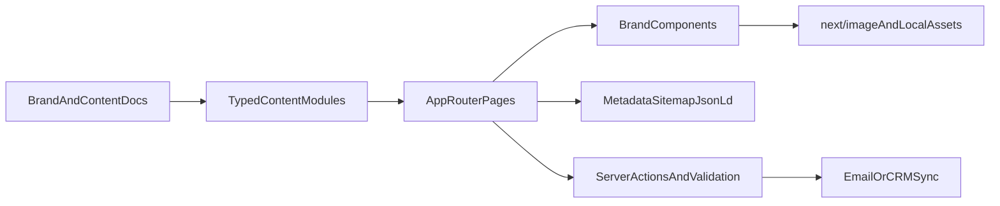

## Elements Workspace Site Build Roadmap

## What This Document Is

This is the implementation roadmap for rebuilding `elementsworkspace.com` as a lean, high-performance marketing site for a Brooklyn homeschooling business.

Plain English version:

- We are building a mostly static brand and marketing website, not a complex web app.
- The hard part is not business logic. The hard part is getting the branding, copy, photography, mobile layout, and trust signals right.
- The stack should stay simple enough to move fast, but strong enough to support forms, SEO, and future growth without repainting the whole house later.

This plan is based on:

- [`elements-brand-design-system.md`](../elements-brand-design-system.md)
- [`elements-website-content-v3.md`](../elements-website-content-v3.md)
- [`elements-photo-placement-guide.html`](../elements-photo-placement-guide.html)

## Executive Decision

### Chosen Stack

- `Next.js 15` with App Router
- `TypeScript`
- `Tailwind CSS`
- `next/font` for `Lora` and `DM Sans`
- `next/image` for all managed photography
- `Server Actions` for forms and lightweight backend logic
- `zod` for schema validation
- `Vercel` for hosting and previews

### What We Are Not Using As A Foundation

- Not `WordPress`
- Not a heavy visual builder
- Not a CMS on day one
- Not `shadcn` as the design system backbone
- Not a large client-side state layer

### Simple Version

Use the normal modern React stack, but build the site like a calm, mostly static editorial website.

That means:

- server-rendered by default
- minimal JavaScript
- custom brand-first components
- content stored in code at launch
- easy path to add a CMS later if editing becomes frequent

## Why This Stack Wins

### Plain-English Summary

`Next.js 15 + Tailwind` is the best compromise for this project because it gives us:

- a stack most developers can work in
- good performance without tricks
- strong SEO defaults
- clean form handling
- room to grow later if the business needs more than a brochure site

### Technical Reasoning

#### Why Not Astro?

Astro is a very good option for a pure marketing site and would likely produce slightly less JavaScript by default.

Why I am not recommending it here anyway:

- the site may grow into forms, CRM integrations, waitlists, seasonal landing pages, and content tooling
- the React/Next hiring and maintenance path is easier
- App Router server components already let us keep the site mostly static
- the performance difference will be negligible if we build this correctly

#### Why Not WordPress?

The content docs are already highly curated and stable. A CMS right now adds:

- plugin surface area
- security surface area
- editorial complexity
- theme/builder compromises
- more maintenance than the site needs

#### Why Not Lean Heavily On `shadcn`?

Because this is a brand-driven site, not a product UI.

`shadcn` is useful as a source of low-level primitives, but if we use it as the visual foundation the site will drift toward generic SaaS styling. That directly conflicts with the voice and visual identity in the brand system.

Recommended position:

- use custom branded components for layout and aesthetics
- use `Radix` or a copied `shadcn` primitive only where behavior matters, like:
  - mobile navigation
  - FAQ accordion
  - maybe a dialog if one is added later

## Product Shape

### Site Goals

- Present Elements Workspace as a warm, serious, credible homeschooling enrichment center
- Turn interest into tours and waitlist submissions
- Build trust with copy, imagery, and clarity
- Leave room for seasonal campaigns like summer camp

### Primary User Actions

- Book a tour
- Join the Fall 2026 waitlist
- Read about programs
- Check FAQ answers
- Contact Jenny

### Core Pages

- Homepage
- About
- Programs
- Summer Camp
- Our Team
- FAQ
- Contact

### Non-Goals For V1

- Parent portal
- Authentication
- Payments inside the site
- Complex blog/CMS workflows
- Search
- Multi-language support
- Heavy analytics instrumentation

## Architecture Summary

### Architecture In Plain English

The site should be structured so the content lives separately from the page layouts. That way:

- pages stay clean
- content edits are easy
- adding a CMS later is much easier

### Technical Diagram



## Recommended App Structure

This is the target project shape, not a rigid law.

```text
app/
  about/
    page.tsx
  contact/
    page.tsx
  faq/
    page.tsx
  programs/
    page.tsx
  summer-camp/
    page.tsx
  team/
    page.tsx
  globals.css
  layout.tsx
  page.tsx
components/
  marketing/
    cta-button.tsx
    footer.tsx
    header.tsx
    hero.tsx
    location-strip.tsx
    section.tsx
    testimonial-card.tsx
  forms/
    contact-form.tsx
    waitlist-form.tsx
  ui/
    accordion.tsx
content/
  shared/
    navigation.ts
    seo.ts
    site.ts
  pages/
    about.ts
    contact.ts
    faq.ts
    home.ts
    programs.ts
    summer-camp.ts
    team.ts
lib/
  actions/
    submit-contact.ts
    submit-waitlist.ts
  schemas/
    contact.ts
    waitlist.ts
  seo/
    json-ld.ts
public/
  images/
    homepage/
    programs/
    summer-camp/
    team/
docs/
  260322COMMS_ELEMENTS_WORKSPACE__SITE_BUILD_ROADMAP.md
README.md
```

## Content Strategy

### Launch Content Source

All launch content should live in typed `.ts` modules, not hardcoded inline across page files.

#### Why This Matters

- easier to review
- easier to swap content later
- better guardrails for hold-only content
- simpler path to future CMS integration

### Example Types To Define Early

- navigation items
- CTA definitions
- testimonials
- FAQ entries
- pricing tables
- page metadata
- photo slots
- hold flags for unpublished content

### Hold Content Rules

The content package explicitly marks some content as hold-only.

These should be represented as explicit booleans or omitted records in the content layer, not hidden with CSS and not commented out in JSX.

Hold-sensitive content includes:

- Summer Camp tuition
- Moonstones lead guide name, bio, and photo until approved
- Starbirds lead guide details until approved

## Design System Translation

### Design Translation In Plain English

The brand guide already did most of the design strategy work. The engineering task is to translate it faithfully without turning it into a messy pile of one-off class strings.

### What To Implement

- CSS custom properties for brand colors
- Tailwind theme extension for:
  - colors
  - font families
  - spacing rhythm
  - max widths
  - border radius tokens
- shared button variants
- shared section background rhythm rules
- typography utilities for:
  - editorial headings
  - body copy
  - small uppercase labels
  - pull quotes

### Important Warning

Do not let Tailwind convenience slowly override the brand system.

Common failure mode:

- default gray palette
- default Tailwind spacing
- generic button styles
- arbitrary responsive tweaks made page by page

That produces a site that is technically fine and visually wrong.

## Image Strategy

### Requirements

- use `next/image`
- store approved production photos in `public/images/...`
- use descriptive filenames
- define `sizes` attributes carefully for major responsive images
- write real alt text based on what is happening in the image

### Performance Guidance

- only the primary above-the-fold hero image should normally be priority-loaded
- use responsive image dimensions to avoid layout shifts
- compress assets before commit
- avoid background-image-only critical content where the art needs meaningful alt text

### Important Skeptical Note

The source content mentions Google Map embeds. Do not blindly embed a heavy interactive map everywhere.

Recommendation:

- homepage: location strip with text plus link out
- contact page: lazy-loaded map embed only if it materially helps conversion

Simple version:

an iframe on every page is lazy thinking; use it only where it earns its cost

## Form Strategy

### Forms In Scope

- waitlist form
- contact form

### Recommended V1 Form Implementation

- validate on the server with `zod`
- submit via `Server Actions`
- keep UI simple and accessible
- return clean success and error states

### Lead Handling Recommendation

For the first implementation, keep the contract simple:

- one server action per form
- one clearly defined external destination per form

Recommended default:

- email notification flow first
- CRM sync second, once the business process is confirmed

Why this is the safer choice:

- fewer moving parts at launch
- easier debugging
- easier to test
- lower operational coupling

If CRM is confirmed before build starts, wire directly to that system rather than building a temporary middle layer.

## SEO And Discovery Plan

### What Matters Most

- strong metadata on every page
- clear local intent around Brooklyn and Gerritsen Beach
- good heading structure
- fast page loads
- good mobile experience
- real alt text

### Technical Deliverables

- route-level `metadata`
- `sitemap.ts`
- `robots.ts`
- canonical URLs
- Open Graph and Twitter metadata
- local business schema
- FAQ schema where appropriate

## Measurement And Analytics

Do not over-instrument V1.

Recommended options:

- `Vercel Analytics` if you want the easiest path
- `Plausible` if you want a cleaner privacy-first setup

Do not start with a heavy analytics stack unless there is an actual decision-making need for it.

## Performance Rules

### Required

- server components by default
- client components only where interaction demands them
- minimal third-party scripts
- lazy-load non-critical media
- preload only critical fonts/images

### Avoid

- animation libraries unless the design truly needs them
- client-side form frameworks for simple forms
- generic UI packages that ship extra JavaScript
- embedding social feeds

## Accessibility Rules

- proper heading order
- keyboard-accessible mobile nav and accordion
- visible focus states
- correct contrast against brand colors
- descriptive alt text
- semantic button/link usage

The terracotta text warning in the brand guide should be treated as a real implementation rule, not a suggestion.

## Delivery Plan

The work should be done in chronological phases with a checkpoint commit after each meaningful slice.

## Phase 0: Pre-Build Setup

### Phase 0 Goal

Get the repo ready so the build starts cleanly instead of accreting random decisions later.

### Phase 0 Plain-English Summary

Before touching page design, lock the technical direction and the content boundaries. This phase prevents avoidable churn.

### Phase 0 Technical Breakdown

- initialize the Next.js app with App Router, TypeScript, and Tailwind
- add font setup with `next/font`
- define a minimal dependency policy
- create the base directory structure
- add a placeholder `README.md`
- add linting and formatting defaults if not already present

### Phase 0 Checkpoint Commit

`chore: initialize elements workspace site foundation`

### Phase 0 Checklist

- [ ] Create the `Next.js 15` app
- [ ] Enable `TypeScript`
- [ ] Install and configure `Tailwind CSS`
- [ ] Add `Lora` and `DM Sans` with `next/font`
- [ ] Set up the initial folder structure
- [ ] Add base metadata and site config placeholders
- [ ] Confirm no CMS is included in v1

## Phase 1: Brand Tokens And Shared Foundation

### Phase 1 Goal

Translate the written brand system into reusable UI primitives.

### Phase 1 Plain-English Summary

This is the phase where the site stops being a generic Next app and starts becoming Elements.

### Phase 1 Technical Breakdown

- map color tokens from the brand guide into CSS variables
- extend Tailwind theme for brand colors and typography
- create shared layout primitives:
  - container
  - section
  - stack
  - button
  - eyebrow label
- build global typography rules in `globals.css`
- establish section spacing and breakpoint decisions early

### Phase 1 Checkpoint Commit

`feat: add brand tokens and shared marketing primitives`

### Phase 1 Checklist

- [ ] Add color CSS variables
- [ ] Extend Tailwind theme with brand colors and fonts
- [ ] Define spacing and max-width conventions
- [ ] Build shared button variants
- [ ] Build section/container primitives
- [ ] Add global typography defaults
- [ ] Verify brand colors meet contrast rules in real UI

## Phase 2: Content Model And Route Skeleton

### Phase 2 Goal

Separate site content from presentation before full page implementation.

### Phase 2 Plain-English Summary

We want content living in one place and page rendering logic living in another. That keeps future edits sane.

### Phase 2 Technical Breakdown

- create typed content modules for all seven pages
- extract shared business data:
  - address
  - phone
  - email
  - Calendly links
  - social links
- define data shapes for:
  - testimonials
  - FAQ items
  - program cards
  - pricing tables
  - hold content
- scaffold all route files and wire metadata exports

### Phase 2 Checkpoint Commit

`feat: add typed content model and route scaffolding`

### Phase 2 Checklist

- [ ] Create shared site config
- [ ] Create per-page content modules
- [ ] Define TypeScript interfaces for page data
- [ ] Add page route skeletons
- [ ] Add metadata placeholders for every route
- [ ] Represent all hold-only content explicitly

## Phase 3: Shared Shell And Navigation

### Phase 3 Goal

Build the reusable shell that every page depends on.

### Phase 3 Plain-English Summary

This is the chrome of the site: header, footer, mobile nav, CTA patterns, and consistent layout rules.

### Phase 3 Technical Breakdown

- sticky header with mobile behavior
- footer with correct business info
- primary and secondary CTA components
- location strip pattern
- optional announcement band pattern
- responsive nav behavior with very light client-side logic only where needed

### Phase 3 Checkpoint Commit

`feat: build site shell and navigation`

### Phase 3 Checklist

- [ ] Build sticky header
- [ ] Build mobile menu
- [ ] Build footer
- [ ] Build CTA button system
- [ ] Build shared location/contact strip
- [ ] Verify keyboard accessibility of nav interactions

## Phase 4: Homepage

### Phase 4 Goal

Ship the highest-value page first and use it to harden the design system.

### Phase 4 Plain-English Summary

The homepage is the main trust and conversion page. If the homepage works, the rest of the site becomes far easier.

### Phase 4 Technical Breakdown

Implement homepage sections in the documented order:

1. sticky navigation
2. hero
3. what is Elements
4. currently running band
5. Fall 2026 callout
6. testimonials
7. getting started
8. location strip
9. footer

Additional guidance:

- match the background rhythm from the brand guide
- build against photo placeholders first if final photography is not ready
- make the CTA hierarchy obvious
- keep copy widths readable on desktop

### Phase 4 Checkpoint Commit

`feat: implement homepage`

### Phase 4 Checklist

- [ ] Build hero section
- [ ] Build What Is Elements section
- [ ] Build Currently Running band
- [ ] Build Fall 2026 callout section
- [ ] Build testimonials section
- [ ] Build Getting Started section
- [ ] Build homepage location strip
- [ ] Optimize above-the-fold content and image loading

## Phase 5: Programs And Summer Camp

### Phase 5 Goal

Implement the pages most likely to drive serious evaluation and seasonal conversions.

### Phase 5 Plain-English Summary

These pages carry the most detailed decision-making content. They need clarity, trust, and strong reading flow.

### Phase 5 Technical Breakdown

- build `Programs` page with:
  - page header
  - Starbirds section
  - Moonstones section
  - enrichment section
  - yoga block
  - why families choose Elements
- build `Summer Camp` as a landing-page-like route
- design pricing tables to be readable on mobile
- hard-gate hold-only guide and tuition content

### Phase 5 Checkpoint Commit

`feat: add programs and summer camp pages`

### Phase 5 Checklist

- [ ] Implement Programs page layout
- [ ] Implement Starbirds content and image slot
- [ ] Implement Moonstones content and image slot
- [ ] Implement pricing tables responsively
- [ ] Implement Summer Camp hero and story sections
- [ ] Gate unpublished Summer Camp content correctly
- [ ] Confirm CTA destinations and placeholders are explicit

## Phase 6: About, Team, FAQ, And Contact

### Phase 6 Goal

Complete the supporting pages that remove hesitation and answer practical questions.

### Phase 6 Plain-English Summary

These pages close the trust gap. Parents need to understand the philosophy, the people, and the logistics.

### Phase 6 Technical Breakdown

- About page with story, philosophy, audience, and space content
- Team page with founder and hold-aware guide sections
- FAQ page with accessible accordion
- Contact page with tour CTA, consultation CTA, waitlist CTA, contact details, and optional lazy map embed

### Phase 6 Checkpoint Commit

`feat: add trust and contact pages`

### Phase 6 Checklist

- [ ] Build About page
- [ ] Build Team page
- [ ] Add hold-aware guide rendering
- [ ] Build FAQ accordion
- [ ] Build Contact page layout
- [ ] Add correct contact details and CTA links
- [ ] Decide whether map embed is worth shipping on Contact

## Phase 7: Forms And Lead Capture

### Phase 7 Goal

Make sure prospective families can actually convert.

### Phase 7 Plain-English Summary

A beautiful site that drops form submissions is worse than a simpler site that reliably produces leads.

### Phase 7 Technical Breakdown

- build waitlist form
- build contact form
- validate with `zod`
- submit through `Server Actions`
- add success and failure states
- wire to the chosen lead destination
- log and monitor submission failures

### Phase 7 Checkpoint Commit

`feat: add lead capture forms`

### Phase 7 Checklist

- [ ] Define schemas for each form
- [ ] Build accessible form components
- [ ] Implement server actions
- [ ] Connect to email or confirmed CRM
- [ ] Add error handling and user feedback
- [ ] Test successful and failed submissions

## Phase 8: SEO, Accessibility, And Performance Hardening

### Phase 8 Goal

Turn a good implementation into a launch-ready implementation.

### Phase 8 Plain-English Summary

This phase is cleanup, but not optional cleanup. It is where the site becomes professional.

### Phase 8 Technical Breakdown

- add final metadata on every page
- generate sitemap and robots files
- add structured data
- audit image behavior and font loading
- verify no unnecessary client bundles
- run accessibility checks manually and with tooling
- review mobile spacing and cropping carefully

### Phase 8 Checkpoint Commit

`perf: harden seo accessibility and performance`

### Phase 8 Checklist

- [ ] Finalize metadata for all pages
- [ ] Add sitemap and robots
- [ ] Add local business schema
- [ ] Add FAQ schema if implemented
- [ ] Audit Lighthouse-style performance risks
- [ ] Audit accessibility and focus states
- [ ] Verify mobile layouts on key breakpoints

## Phase 9: Launch Preparation

### Phase 9 Goal

Prepare the site to replace the old web presence cleanly.

### Phase 9 Plain-English Summary

Launch issues are often not code issues. They are domain, redirect, missing asset, and stale-content issues.

### Phase 9 Technical Breakdown

- verify domain setup
- prepare redirects from old WordPress routes if needed
- remove or redirect broken subdomains
- confirm all CTA links
- confirm all hold sections are still properly hidden
- confirm all photos have alt text and are production-ready

### Phase 9 Checkpoint Commit

`chore: prepare production launch`

### Phase 9 Checklist

- [ ] Confirm domain and deployment target
- [ ] Define redirect list from old URLs
- [ ] Remove dead subdomain behavior
- [ ] Confirm all external links
- [ ] Confirm all hold content is suppressed
- [ ] Confirm all image alt text is complete

## Suggested Pull Request Breakdown

If you want cleaner review boundaries, break the work into PR-sized chunks like this:

1. `PR 1` Foundation, tokens, and app skeleton
2. `PR 2` Shared shell and homepage
3. `PR 3` Programs and Summer Camp
4. `PR 4` About, Team, FAQ, Contact
5. `PR 5` Forms and integrations
6. `PR 6` SEO, accessibility, performance, launch prep

If you are working solo and not opening PRs, use the same boundaries as checkpoint commit batches.

## Dependency Guidance

Keep dependencies tight.

Recommended:

- `next`
- `react`
- `react-dom`
- `typescript`
- `tailwindcss`
- `zod`
- optionally `@radix-ui/react-accordion`
- optionally `@radix-ui/react-dialog`

Avoid adding packages just to save 30 lines of code on a simple marketing site.

## Risks And Failure Modes

### Biggest Risks

- the site looks generic even though the content is strong
- too much client-side JavaScript sneaks in
- forms become overengineered
- hold-only content accidentally ships
- photo treatment is inconsistent
- mobile spacing gets less attention than desktop

### How To Reduce Risk

- content model first
- brand tokens first
- homepage before all inner pages
- explicit hold flags
- minimal dependencies
- manual mobile QA every phase, not just at the end

## Definition Of Done

The build is complete when:

- all seven pages exist and are production-ready
- the homepage and inner pages match the brand system
- forms submit successfully to the chosen destination
- SEO metadata is complete
- images are optimized and accessible
- hold-only content is safely excluded
- the site feels custom and trustworthy, not template-derived

## Final Recommendation

Build this as a carefully structured `Next.js 15` marketing site with custom brand components, content in code, minimal JavaScript, and a clear post-launch path for CMS or CRM additions if the business actually needs them.

That is the least complicated approach that still leaves you room to grow.
